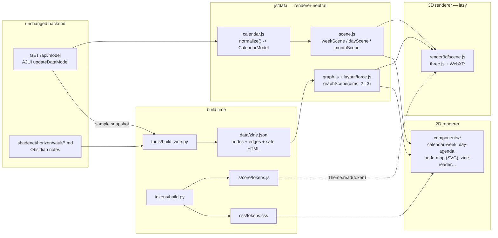

# One data model, two renderers: 2D DOM and 3D/AR

NightCal renders the same content as a flat website (the baseline, which needs no WebGL) and as a 3D scene with WebXR AR (progressive enhancement). Both renderers read **one** data layer and **one** token set, so the site and the scene can't drift apart.



## Layers

| Layer | Files | Knows about | Never knows about |
|---|---|---|---|
| **Adapter** | `js/data/calendar.js` | The backend's JSON shape (`/api/model`). Falls back to `data/sample-model.json`. | The DOM, three.js, layout |
| **Scene models** | `js/data/scene.js`, `js/data/graph.js`, `js/layout/force.js` | Days, weeks, months, graph nodes and edges, positions | How anything is drawn |
| **Tokens** | `tokens/*.json` → `css/tokens.css` and `js/core/tokens.js` | Every visual value | Components |
| **2D renderer** | `components/*`, `js/pages/*` | Scene models, CSS tokens | three.js |
| **3D renderer** | `js/render3d/scene.js` | Scene models, tokens via `Theme.read()` | The backend |

The adapter is the **only** module that knows the backend's field names. If the backend changes shape, you change one pure function, `normalize()`.

## The shared scene models

```ts
// js/data/scene.js
weekScene(model, { date, scope, venueId }) -> {
  kind: "week", start, end, label,
  days: DayNode[7]
}
DayNode = { date, weekday, weekdayShort, day, month, long, isToday, isSelected, events: Event[] }
Event   = { id, title, date, start, end, minutes, kind, kindLabel, tone, glyph, venueId, venueName, url, … }

// js/data/graph.js
graphScene(zine, { dims: 2 | 3 }) -> {
  kind: "graph", dims, nodes: Node[], edges: Edge[], byId
}
Node = { id, type, title, summary, html?, ref?, degree, x, y, z, r }
Edge = { source, target, kind: "link" | "events" | "venues" | "at" }
```

* `calendar-week` (DOM) and the `WeekLayer` (3D) take the **same** `weekScene()` object. Day order, labels, counts and event ids are identical.
* `node-map` (SVG) calls `graphScene(zine, { dims: 2 })`. The AR scene calls `graphScene(zine, { dims: 3 })`. Each layout is seeded from the node ids, so it is stable between builds, and a node keeps its id in both renderers.
* A selection is a plain `{ kind, id }` in both renderers: DOM components fire `nc-select`, and 3D picking calls `onSelect(userData)`. The page opens the **same** `eventCard` or `zineCard` component either way, as a DOM overlay on top of the canvas.

## The AR scene graph

```
Scene
├─ HemisphereLight, DirectionalLight
├─ XR controller 0                 "select" -> raycast -> onSelect(userData)
└─ World (Group)                   1 unit = 1 m. In AR: scale 0.5, placed 0.6 m in front, 0.4 m up
   ├─ WeekLayer (Group)            mode "week"
   │  └─ DayPanel × 7 (Group)      on a 112° arc, radius 3 m, facing the viewer
   │     │                         userData { kind: "day", date }
   │     ├─ DayHeader (Mesh)       CanvasTexture: weekday, date, count (token colours, system font)
   │     └─ EventBillboard × ≤5    CanvasTexture: time, title, room, kind tag
   │                               userData { kind: "event", id }
   └─ GraphLayer (Group)           mode "graph"
      ├─ Edges (LineSegments)      colour: color-graph-edge
      └─ NodeMesh × n              geometry by node type (same shapes as the 2D glyphs:
         │                         sphere=circle, octahedron=diamond, box=square,
         │                         tetrahedron=triangle, hex prism=hexagon, torus=ring)
         │                         colour: color-node-<type>; userData { kind: "node", id }
         └─ Label (Sprite)         notes and the selected node only
```

Rules the 3D renderer follows:

1. **Tokens, not literals.** Colours and fonts come from `Theme.read("color.surface")` and similar. On `nightcal:themechange` (including a system light/dark flip) the textures are redrawn, so a Steward's theme reaches AR too.
2. **Shape plus label, never colour alone.** The same kind and type glyphs as 2D, and billboards carry text.
3. **An accessible twin.** The canvas is `aria-hidden`. The page lists the same items as real buttons and rows below it. Activating one opens the same card the 3D pick opens.
4. **No idle GPU.** Outside XR, a frame is drawn only when the camera moves. XR sessions use `setAnimationLoop`.
5. **Reduced motion.** Camera damping is off when `Theme.reducedMotion()` is true. Nothing animates on its own.

## Progressive enhancement

| Capability | What the reader gets |
|---|---|
| No JavaScript | A static heading and a notice. (The calendar's data comes from a JSON API, so a no-JS listing would need server rendering by the backend team.) |
| JavaScript, no WebGL | The full 2D site. `/3d/` says it can't draw 3D and shows the same items as a list. **three.js is never downloaded** (checked in `tests/run.mjs`). |
| WebGL | `/3d/` lazy-loads `vendor/three/three.module.min.js` (about 170 KB gzipped) through an import map, only on that route |
| WebXR `immersive-ar` | A "Place in your room (AR)" button: `local-floor` reference space and a DOM overlay so the event card shows in AR |
| WebXR `immersive-vr` | An "Enter VR" button |

## What this pass delivers, and what it doesn't

Delivered:
* A working three.js scene on `/3d/` with the week billboards and the 3D zine graph.
* Orbit, zoom, picking and the shared cards.
* Theme-reactive textures.
* WebXR session start for AR and VR with controller picking.

Not done yet:
* Hit-test placement on real surfaces, and anchors.
* Hand tracking.
* Spatial audio.
* Text rendered as SDF (CanvasTexture text softens at a distance).
* Per-reader layout preferences in 3D (density and text scale currently affect only the 2D site and the texture redraw).
* Real-device AR testing. **It ran in headless Chromium without an XR device, so the XR code paths are written but unverified on hardware.**
