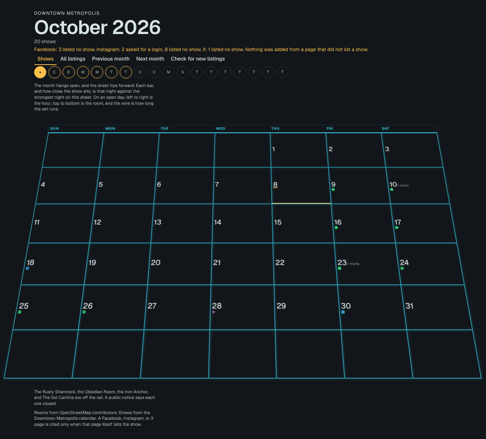
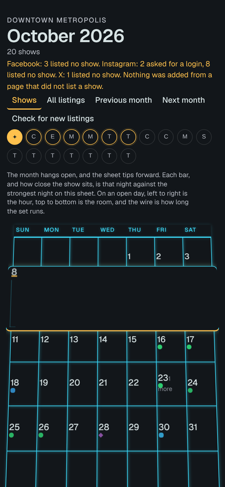

# Audit of the legacy calendar (`shadenet/nightcal/static/index.html`)

Captured on 2026-10-08 against the bundled database, with headless Chromium at 390×844 (phone) and 1280×860 (desktop). To reproduce: start the nightcal server, then run `node web/tools/audit_legacy.mjs http://127.0.0.1:8765/`. Raw output is in [`audit/axe-legacy.json`](audit/axe-legacy.json).

| Desktop | Phone, day opened |
|---|---|
|  |  |

**axe-core reported 0 violations.** Every problem below is one an automated checker can't see: hidden text, meaning carried only by dots, a 3D tilt that distorts the grid, and copy that is not for visitors. A clean axe run here does not mean the page is accessible.

## Visibility: events are hard to see

| # | Problem | Evidence | Severity |
|---|---|---|---|
| V1 | **Event names are not shown on the month at all.** Every show is a coloured dot. The title only appears on hover or after a day is opened. | `.obj-rest::after { font-size: 0; color: transparent }`. In the desktop shot, 20 shows appear as about 20 dots. | Critical |
| V2 | **Opening a day hides the rows around it** and can open empty. On the phone, opening Oct 8 covers the whole Oct 4–10 week, and the panel has nothing in it. | `legacy-mobile-open-day.png`. The open day is `position:absolute` at `--open` × its size. | Critical |
| V3 | **The 3D tilt distorts the grid.** `rotateX(22deg)` (house default) with `perspective` makes the bottom rows wider than the top. A sixth, empty row sticks out of the sheet. | Desktop shot, rows 5–6 | High |
| V4 | **The genre is encoded by colour and shape only** (green circle, red diamond, …). The legend uses 0.65rem text. | `.obj-kind-*`, `.obj-legend-item` | High |
| V5 | **The room rail is 18 unlabelled circles** holding one letter each (C, E, M, M, T, T…). You can't tell which room is which without hovering over each one. | Desktop shot, row under the controls | High |
| V6 | **The "today" marker is a 2px underline** under the date number. | `.day.is-today .num` | Medium |

## Stray text that isn't for visitors

| # | Text | Where | Fix in the redesign |
|---|---|---|---|
| S1 | "Facebook: 3 listed no show. Instagram: 2 asked for a login, 8 listed no show. X: 1 listed no show. Nothing was added from a page that did not list a show." It is shown in amber, the most prominent colour on the page. | `ui.status` | Moved under the footer's "About this data" disclosure |
| S2 | "The month hangs open, and the sheet tips forward. Each bar, and how close the show sits, is that night against the strongest night…" | `ui.depthNote` | Removed: the redesign has no tilt or depth encoding to explain |
| S3 | "The Rusty Shamrock, the Obsidian Room, the Iron Anchor, and The Sol Cantina are off the rail…" | `ui.closedNote` | Moved under "About this data" |
| S4 | "Opening the calendar…" boot text in 1.8rem display type | `#app .boot` | Replaced by a static first paint with real headings |
| S5 | "Downtown Metropolis" in the `<title>`, the eyebrow and the attribution | `surface.py:149`, `:612`, `:633` | Pages use `web/site.json` ("Downtown Santa Rosa"). The attribution string still comes from the server; see open items |

## Closed venues

| # | Problem | Fix in the redesign |
|---|---|---|
| C1 | The rail lists every room the server returns (18 circles), including rooms with nothing on. `closures.py` hard-codes 4 closed rooms. `surface.py:481` hides a closed room only when it has no booked show. | The room filter lists **only rooms with at least one listing**. A closed room can't appear unless a cited listing places a show there, and that is the same evidence rule the server uses. No backend change was needed. |
| C2 | The closure list is static, so it will drift. | **Open item for the backend team.** The front end cannot know a closure the data doesn't carry. |

## Accessibility (WCAG 2.2)

| # | Criterion | Problem | Measured |
|---|---|---|---|
| A1 | 1.4.3 Contrast | `--quiet` #8a8f98 on `--sheet` #ecece4 (weekday labels, "+N more", empty state) | 2.74:1 (needs 4.5) |
| A2 | 1.4.3 Contrast | White labels on genre fills: green 2.10, blue 3.15, red 3.82 | Fail |
| A3 | 1.4.11 Non-text | `--bulb` #FFC14D selected underline on the sheet | 1.36:1 (needs 3) |
| A4 | 1.4.4 / readability | 31 text elements under 12px: `.obj-label` 9.6px ×19, unclassed spans 10.4px ×7, `.more` 10.4px ×2, footer 11.5px ×3 | `axe-legacy.json → textUnder12px` |
| A5 | 2.5.8 Target size (and the project's 44px goal) | Room circles 27×27 ×18; controls 31px tall; skip link 34px | `targetsUnder44px` |
| A6 | 1.4.1 Use of colour | Genre is told apart by colour and shape only, with no text at rest | V4 |
| A7 | 1.3.1 Info and relationships | The month is a grid of `<button>`s with no grid semantics, and every day is its own tab stop (31+ stops to get across a month) | Tab order in `axe-legacy.json → tabStops` |
| A8 | 2.3.3 / reduced motion | The tilt is removed under reduced motion, but the house default re-applies the 22° tilt for everyone else, and there is no in-page control | `surface.py HOUSE_TILT` |
| A9 | 1.3.4 / 1.4.10 Reflow | The open day is fixed to `calc(100vw - 1.4rem)` and overlaps neighbours. The rail scrolls horizontally on phones. | V2 |

## Performance

* The Geist font loads from Google Fonts as a render-blocking `<link>`.
* The first meaningful paint waits for the full A2UI stream.
* The page is a single 542-line HTML file with no code splitting (fine at this size, but there is nothing to split from).

The redesign's own audit, against the same criteria plus WCAG 2.2 AA, is in [ACCESSIBILITY.md](ACCESSIBILITY.md).
