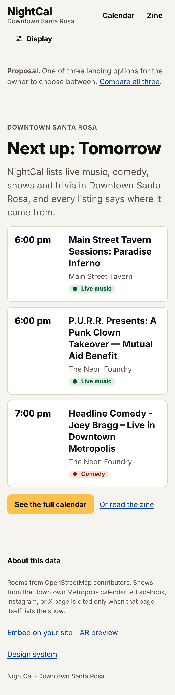
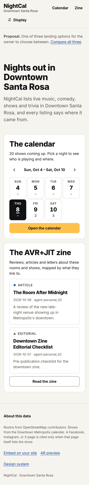
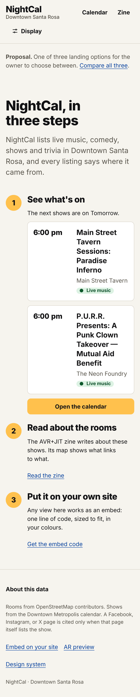

# Landing page: three options for the owner

**The owner needs to pick one.** All three are built and run on live data. Compare them at `/landing/`. Until you choose, `/` stays the calendar, which is what the site serves today. The brief: orient a first-time visitor in under 10 seconds (what this is, the calendar, the zine, next steps), with one primary action.

| | A · Tonight first | B · Two doors | C · Three steps |
|---|---|---|---|
| Route | `/landing/a/` | `/landing/b/` | `/landing/c/` |
| First thing seen | "Next up: tomorrow", then the next 3 shows as big rows | "Nights out in Downtown Santa Rosa" + one sentence | "NightCal, in three steps" + one sentence |
| Primary action | See the full calendar | Open the calendar | Open the calendar (step 1) |
| Zine | A text link under the button | An equal panel with 2 zine cards | Step 2 |
| Embeds / promoters | Footer only | Footer only | Step 3 |
| Answers in under 10 s | "What's on?" right away; "what is this?" from the lede | "What is this?" first, then two clear doors | "What can I do here?" as a sequence |
| Risk | The zine is easy to miss | Two equal doors can split attention | The longest page; the most reading |
| Best if | Most visitors arrive asking "what's on tonight?" | The zine should be as prominent as the calendar | Venues and promoters who might embed it are a key audience |

| A | B | C |
|---|---|---|
|  |  |  |

**Recommendation (yours to override):** A. It assumes most visitors come to decide where to go tonight. There is no traffic data to check that assumption against. A answers that question before anything else. The zine link and the footer cover the rest. If the zine is a co-equal product, choose B.

**To ship a choice:** in `web/routes.json`, point `/` at `js/pages/landing.js` with that `"variant"`, and move the calendar to `/calendar/`. Then run `npm run build`. The links in `site-header` already treat `/calendar` as the calendar.
